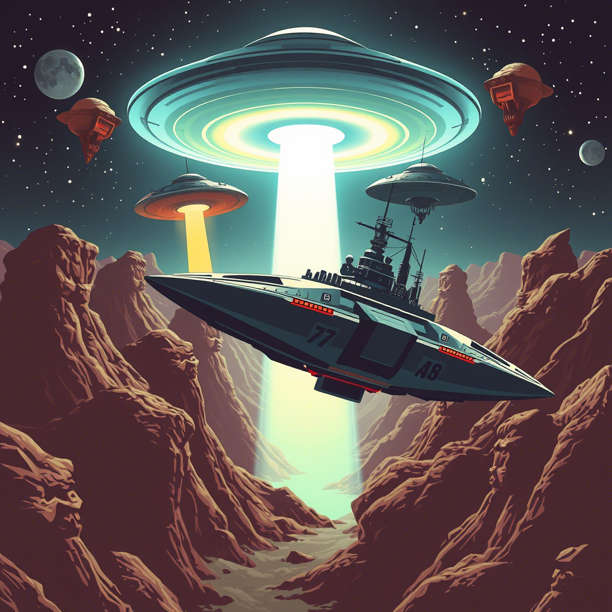

🎮 **Retro Arcade Games Collection** 🌟
=====================================

> 🚨 ВНИМАНИЕ! Этот репозиторий содержит **100% чистый ностальгический пиксель** 🌌

🎮 Наши игры 🎮

🐱 Cat Adventure
Приключения кота
- Платформер
- Сбор предметов
- Преодоление препятствий

🐛 Centipede
Аркадный шутер
- Сражение с многоножкой
- Разрушаемые грибы
- Уклонение от пауков

⛏️ Dig Dag
Классическое аркадное приключение с камнями
- Подземные сражения
- Сбор алмазов
- Уклонение от монстров
- Не хочешь уклоняться - бей камнями

🐒 Donkey Kong
Классический платформер 1981 года
- Уворачивайтесь от бананов
- Собирайте монеты

🛡️ Heroes: Tactical Battles
Пошаговая тактика с глубиной
- 100+ уникальных юнитов (маги/рыцари/лучники)
- Система пассивных и активных способностей
- Динамическая генерация карт

🍞 Kolobok Quest
Сюжетная аркада с:
- Кулинарными боссами
- Системой рецептов
- Механикой "подкатывания" 🥞

🟡 Pac-Man
Игра, съевшая мир!
- Лабиринтный экшен
- Призраки-преследователи
- Система фруктовых бонусов

🌊 Sea Adventure
Морское приключение
- Исследование океана
- Сбор сокровищ
- Встречи с морскими обитателями

🌞 Solar System
Интерактивная модель Солнечной системы
- Визуализация планет и их орбит
- Информация о каждой планете
- Масштабируемое представление

🛸 Space Defender
Сражение в астероидном поле
- Управление космолетом WASD
- Система щитов и бустеров
- Волны НЛО-агрессоров

🎮 Tetris
Легендарная головоломка
- Классические фигуры
- Нарастающая сложность
- Система очков

💡 Особенности коллекции 💡

✅ Чистый код с комментариями все работает в html 
✅ Адаптивное управление - в разработке 
✅ Кроссплатформенность  
✅ Пасхалки в каждой игре 🥚

🛠️ Как запустить 🛠️

git clone https://github.com/Mortrey/arcade_games.git
cd arcade-games/[FOLDER_NAME]
запустить .html в любом браузере

📜 Лицензия: MIT
© 2025 Mortrey | 📨 Написать разработчику

⚡ Поддержите проект:
🌟 Поставьте звезду
📝 Предложите новые идеи
🎮 Станьте тестировщиком 